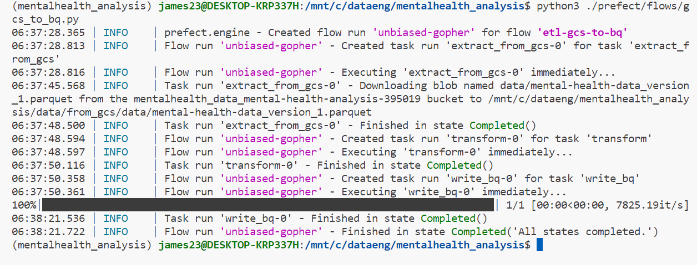

## MENTAL HEALTH ANALYSIS DATA PIPELINE
An end to end data pipeline built using  python, prefect, gcp, dbt cloud

## PIPELINE ARCHITECTURE


## PREREQUISITES
- Python 
- prefect
- GCP
- dbt cloud
- terraform

Setup a python venv and install the required packages
- Python packages: install the required packages using the [requirements file](requirements.txt)

## CREATING INFRA ON GCP USING TERRAFORM
- Configure gcloud sdk on your machine and setup terrraform
- create a terraform directory to initialize terrafrom files
```python
# download and setup terraform
wget -O- https://apt.releases.hashicorp.com/gpg | sudo gpg --dearmor -o /usr/share/keyrings/hashicorp-archive-keyring.gpg
echo "deb [signed-by=/usr/share/keyrings/hashicorp-archive-keyring.gpg] https://apt.releases.hashicorp.com $(lsb_release -cs) main" | sudo tee /etc/apt/sources.list.d/hashicorp.list
sudo apt update && sudo apt install terraform

# set credentials for gcp
export GOOGLE_APPLICATION_CREDENTIALS="yourkeys.json"

# Refresh token/session, and verify authentication
gcloud auth application-default login

# Initialize state file (.tfstate)
terraform init

# Check changes to new infra plan
terraform plan -var="project=<your-gcp-project-id>"

# Create new infra
terraform apply -var="project=<your-gcp-project-id>"

```
- configure [variables.tf](/terraform/variables.tf) and [main.tf](./terraform/main.tf) before running plan and apply commands


## RUNNING PREFECT FLOWS
- Create a prefect directory and inside add flows and blocks folders
- Start prefect server 
- Setup kaggle access
```python
# setup kaggle api access
mv kaggle.json /home/james23/.kaggle/kaggle.json
```
run the flows to ingest data and load into bigquery

```python
# start prefect orion server
prefect server start

# register your custom block
prefect block register --file my_block.py

# run your flows 
python3 ./prefect/flows/data_to_gcs.py

python3 ./prefect/flows/gcs_to_bq.py
```



## RUNNING TRANSFORMATIONS IN DBT CLOUD
- setup a dbtcloud account
- clone your github repo and initialize dbt
- setup database credentials in dbt cloud for bigquery (bigquery)
- create and configure [dbt_project.yml](dbt_project.yml), macros and models accordingly
- run the builds in developer mode

Example of macros [get_gender_properties.sql](./macros/get_gender_properties.sql)

Example of staging-moudules(for development) [stag_mentalhealth_data.sql](./models/staging/stag_mentalhealth_data.sql)

Example of core models(for production) [dim_employee.sql](/models/core/dim_employee.sql)

- IMPORTANT: configure the development env with the correct target database/dataset for bigquery


## ADDING A DEPLOY ENVIRONMENT ON DBT CLOUD
- This evironment runs jobs for loading data into production tables
- set up the deployment enviroment
- add job runs and schedule them


## VISUALIZING THE DATA
- looker studio is used to build the dashboard for analysis

link looker-dashboard of [mental health analysis](https://lookerstudio.google.com/reporting/5b1d13dd-db9b-4260-92aa-7157a061eb95)


- IMPORTANT: configure the deployment env with the correct target database/dataset for bigquery

## NEXT STEPS
You can customize this project in the following ways.

- Run the flows in prefect cloud

- Enhance deployment by adding triggers (eg. on pull request )

## CONTRIBUTING

Contributions are welcome! If you have any ideas, improvements, or bug fixes, please open an issue or submit a pull request.

## LICENSE

This project is licensed under the [MIT License](LICENSE).


